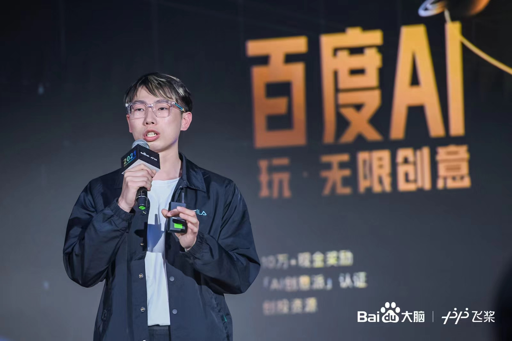

### Hi there 👋

Welcome! I'm Jayce Ning.

  <a href="./README.md">English</a> |
  <a href="./README_zh.md">中文</a>

 

  
  
  
  
  

* 🎓 I'm currently studying for a master's degree in **Beijing University of Posts and Telecommunications**.
* 🤖 Interested in **AGI**, **LLM** and **embodied AI**.

You can also visit my blog at [HewWorkshop](https://jaycening.github.io/).

## 📑 Recent Study

- **DGoT: Dynamic Graph of Thoughts for Scientific Abstract Generation.** [[paper]](https://www.semanticscholar.org/paper/DGoT%3A-Dynamic-Graph-of-Thoughts-for-Scientific-Ning-Zhao/3ec6428566b0e5340fe71abf23ffeae6bf03affb) [[code]](https://github.com/JayceNing/DGoT)
   **Xinyu Ning**, Yutong Zhao, Yitong Liu*, Hongwen Yang.
   *The 2024 Joint International Conference on Computational Linguistics, Language Resources and Evaluation (**LREC-COLING 2024**) 2024*.

- **STSR: A Satellite-Tailored Segment Routing Method for Efficient Space Communication.** [[paper]](https://www.semanticscholar.org/paper/STSR%3A-A-Satellite-Tailored-Segment-Routing-Method-Zhao-Wu/48d3484ba487be7923145148804fcd48b173a552)
   Yutong Zhao, Weihong Wu, **Xinyu Ning**, Yunyi Tang, Sijia Li, Chicheng Qin, Jiang Liu.
   *2024 IEEE Wireless Communications and Networking Conference (**WCNC**) 2024*.
  
- **Optimization of VR Video Wireless Transmission Based on Fountain Code.** [[paper]](https://www.semanticscholar.org/paper/Optimization-of-VR-Video-Wireless-Transmission-on-Ning-Tian/9bd825697f88e82aeeba0da590090c9f04166a14)
   **Xinyu Ning**, Kaicong Tian, Yun Shen, Yitong Liu*, Hongwen Yang.
   *IEEE international Symposium on Broadband Multimedia Systems and Broadcasting (**BMSB**) 2023*.

## 🚀 Projects Showcase

### 💡 ChatBrain AI Academic Assistant
AI Academic Platform Based on Large Language Models.

**Features**
* **Paper Database Plus**: Automatically Summarize and Save Arxiv Papers.
* **Data Analysis**: Analyze Data in the Database and Draw Charts.
* **Review Generation**: Automatically Generate Reviews in Specific Fields.

Details can be found on [ChatBrain](https://github.com/JayceNing/ChatBrain).

### 💡 AI Training Platform
AI Training Frontend and Backend System Based on Kubernetes.

(Basic Functionality AI Training Platform Modeled after ***Huawei ModelArts*** or ***Baidu EasyDL*** Platform)

**Features**
* **User-Friendly Operation**: Web-based Interaction, Supporting Environment(Image) and Model Storage, One-Click Training, Online Programming Based on Jupyter, and Result Visualization, and More.
* **Developed based on Kubernetes**: Container-based Resource Scheduling, Support for Multi-node and Multi-GPU/NPU Configurations. Pre-installed with Various Common Environments.

### 💡 Android, HarmonyOS, or WeChat Mini Program Development

  
Campus Waste Sorting Android App <a href="https://github.com/JayceNing/AndroidApp_Fenleiyouwo">AndroidApp_Fenleiyouwo</a>

   
  

  
Rural Courier Service Mini Program <a href="https://github.com/JayceNing/WechatMiniProgram_GongYou">WechatMiniProgram_GongYou</a>

   
  

  
Campus Waste Sorting Mini Program <a href="https://github.com/JayceNing/WechatMiniProgram_FenLeiYouWoCampus">WechatMiniProgram_FenLeiYouWoCampus</a>

   
  
   
  

  
Bird Science Popularization Mini Program <a href="https://github.com/JayceNing/WechatMiniProgram_ZhiHui">WechatMiniProgram_ZhiHui</a>

   
  

  
HarmonyOS Fan Control <a href="https://github.com/JayceNing/Harmony_APP_Smart_Fan">Harmony_APP_Smart_Fan</a>

   
  

## 🏆 Awards and Honors
### ✨ Internet+ Competition (2023)

The **First Prize** 🥇 in the Beijing Division of the **9th China International "Internet+" University Students Innovation and Entrepreneurship Competition**.

### ✨ CICAS (2023)
The **First Prize** 🥇 in the Seed Group of the **2023 First China’s Innovation Challenge on Artificial Intelligence Application Scene (CICAS2023)**.

* 🥇 Rank < 28/2432

### ✨ Datang Cup (2022)
The **First Prize** 🥇 and **National Champion** 🏆 in the National Finals of **the 9th "Datang Cup" National College Student Mobile Communication 5G Technology Competition**.

* 🥇 Rank 1/25000+

### ✨ AI Creative Group (Baudu 2022)
**Third Prize** 🥉 in **Baidu Cognitive AI Creative Competition** - Creative Development Group.

<video controls>
  <source src="./video/Baidu_meta.mp4" type="video/mp4">
  Your browser does not support the video tag.
</video>

* See the list of [winners](https://nlp.baidu.com/AIPai/WinList).

* My photo 📸 appeared in **one of the top three AI Chinese magazines** : **量子位 QbitAI**. See the coverage in [QbitAI](https://mp.weixin.qq.com/s/-JSayfnewZ4zBSBTTnNdig).

## GitHub Stats

<!--
**JayceNing/JayceNing** is a ✨ _special_ ✨ repository because its `README.md` (this file) appears on your GitHub profile.

Here are some ideas to get you started:

- 🔭 I’m currently working on ...
- 🌱 I’m currently learning ...
- 👯 I’m looking to collaborate on ...
- 🤔 I’m looking for help with ...
- 💬 Ask me about ...
- 📫 How to reach me: ...
- 😄 Pronouns: ...
- ⚡ Fun fact: ...
-->
